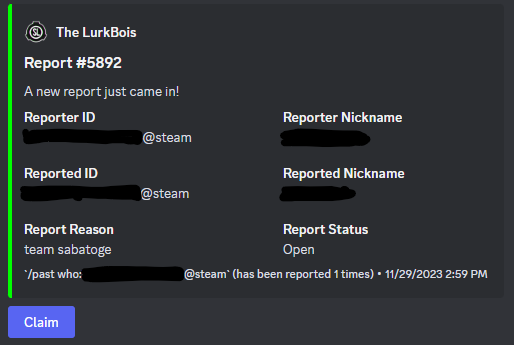

# Lurk-chan


Lurk-chan is a discord bot to manage reports from SCP:SL servers. Originally created for The Lurkbois, but is now open-source.

## What even is a lurk-chan?

Lurk-chan transforms the regular reports from SCP:SL servers into a more readable format. It also provides features that make reports more like tickets. Lurk-chan is drag and drop. Just add it to the server you get report webhooks in, and it will start working instantly! No need to change your server's configuration.

## Features

* Replace the old SL reports with a more readable format.
* Discord reports!
* Track staff report handling
* Track report count for users

## Images




Closing a report uses modals for ease of use.


Closing a report creates an audit in the right channel automatically


## Usage

### Get a bot

First you need to create a new discord bot. This is done through the [discord developer portal](https://discord.com/developers/applications). Once you have a bot created, you need to invite it to your server. This is done by going to the bot in the developer portal, clicking on OAuth2, then URL Generator. Select the following values:


Use the url to add the bot to the server you receive report webhooks from.


***WARNING: All commands and buttons are open to the public by default, if you are adding Lurk-chan to a publicly facing server, you MUST restrict the channels reports arrive in to be readable ONLY by staff, and configure the integration to ONLY allow staff to run the bot's commands.***

### Installation

There are three ways to install Lurk-chan

#### Build from source

Requirements:

* Rust 1.74.0

To build Lurk-chan from source:

1. Ensure you have all of the requirements installed.
2. Clone the repository with `git`
3. Build the project inside of the cloned repository with `cargo build --release`
4. Binaries will be found in `target/release`

#### Install from docker

We publish pre-made images under `wackery/lurk_chan`. With Docker, the config and database files are created under `/home/container`

#### Pterodactyl Panel

A pterodactyl egg for Lurk-chan is available. See `egg-lurk-chan.json` in the repository. This is how it is used internally, and this configuration is fully supported. Please note that Lurk-chan does not require any ports.

### Configuring

If you were to start the bot now, it would probably error out because the config is invalid. Edit the file `config.toml` to configure the bot. All values are required. An example config is below:

```toml
[main]
# this should be the discord token of the bot. from the discord developer portal
token = "1234"


[secret_lab]
# change me to the id of the sl audits channel
audit = 5678

[discord]
# change me to the id of the discord audits channel
audit = 1234
# change me to the id of the stats channel
stats = 5678
# channel for discord reports
reports = 7979
```

#### Getting a channel ID
To get the ID of a channel, enable developer mode on your discord client (Settings -> Advanced -> Developer Mode), then right click on the channel and click "Copy ID". 

#### SL Audit channel
The SL audit channel is where the bot will post audit messages for reports. 

#### Discord Audit channel
The discord audit channel is where the bot will post audit messages for discord reports.

#### Discord Reports channel
The discord reports channel is where the bot will post discord reports.

#### Stats channel
The stats channel display's various stats about the bot, including a top 15 leaderboard for staff.


## Running
Just run the bot using whatever method you prefer (Binary, docker, ptero egg). If you are using docker, you should mount `/home/container` to a volume on your host machine. This will allow you to edit the config and database files. Pterodactyl does this automatically, and the files are accessible within the panel. 

## Contributing
Just make a PR and dont be a jerk. This is a hobby project, and the code is pretty messy.

## License
Lurk-chan is licensed under the MIT license. See LICENSE for more information.